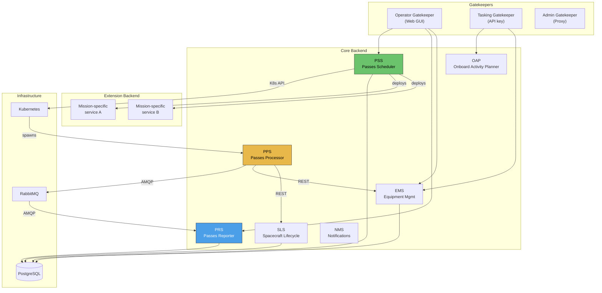
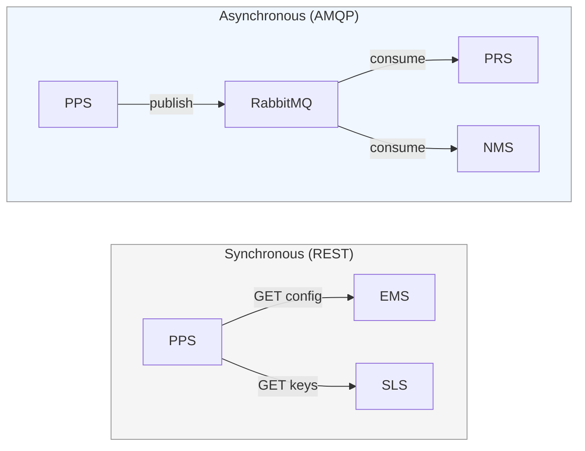
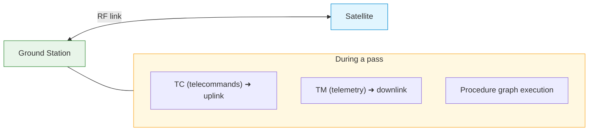

# Mission Control Software (MCS) Overview

## What it is
The MCS is a **microservice-based backend** for operating spacecraft. It handles ground planning, pass execution, telemetry/telecommand processing, and spacecraft lifecycle management.

> This is the **control plane** for satellite operations — configuration, orchestration, and state management.

---

## Architecture layers

### Core backend
Mission-agnostic microservices with well-delimited responsibilities:

| Service | Abbr | Role |
|---|---|---|
| Passes Scheduler Service | PSS | Ground planning, triggers pass execution |
| [[05_MCS/Passes_Processor_Service\|Passes Processor Service]] | PPS | Executes a single pass (ephemeral batch) |
| [[05_MCS/Passes_Reporter_Service\|Passes Reporter Service]] | PRS | Stores & serves pass execution data |
| Equipment Management Service | EMS | Satellite, constellation & ground station config |
| Spacecraft Lifecycle Service | SLS | Spacecraft state tracking & history |
| Onboard Activity Planner | OAP | Mission planning, activity-to-TC transformation |
| Notification Management Service | NMS | Event routing & operator notifications |

### Extension backend
Mission-specific services for spacecraft-specific orchestration (error recovery, payload handling, etc.).

### Gatekeepers
Security layer — no backend service is directly exposed. Gatekeepers handle authentication, authorization, and actor-specific concerns.

| Actor | Auth | Notes |
|---|---|---|
| Operator | JWT / OIDC | Web GUI |
| Tasking Software | API key | Headless API |
| System admin | Third-party redirect | Proxy |

---

## Communication patterns
- **Synchronous REST** — when the caller must fail or block on the target's response
- **Asynchronous AMQP (RabbitMQ)** — for decoupled event-driven flows (e.g. PPS publishing events, PRS consuming them)

---

## Key concept: the pass

A **pass** is a time window during which a ground station has line-of-sight to a satellite.

See [[05_MCS/Pass_Lifecycle]] for the full flow.

---

## Links
- [[05_MCS/Pass_Lifecycle]]
- [[05_MCS/Passes_Processor_Service]]
- [[05_MCS/Passes_Reporter_Service]]
