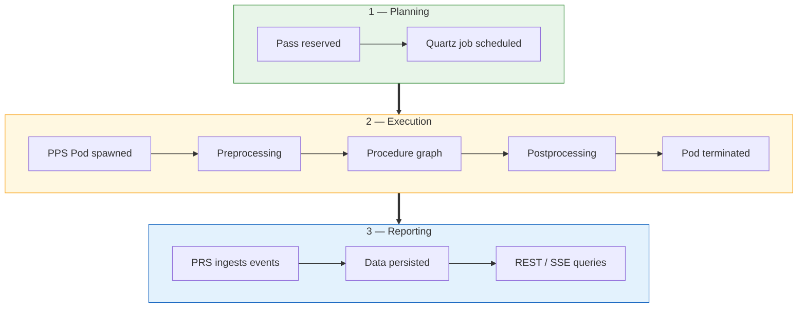
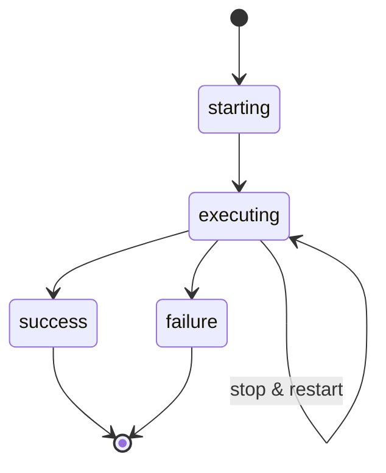
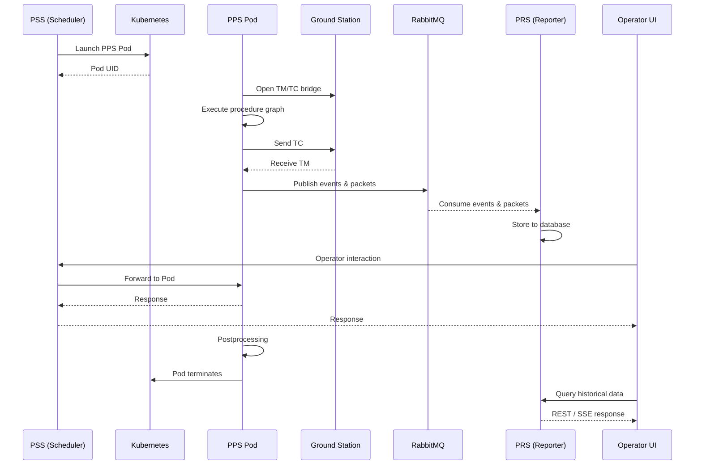

# Pass Lifecycle

A pass goes through several phases, coordinated by three core services: **PSS**, **PPS**, and **PRS**.

---

## Bird's-eye view

---

## Scheduling (PSS)

When a pass is **reserved, updated, imported, or cancelled**, the PSS creates/updates/cancels a Quartz scheduled job. When the job deadline fires:
1. Pass details are fetched from the database
2. PSS calls the **Kubernetes connector** to launch a PPS Pod

---

## Execution (PPS)

The [[05_MCS/Passes_Processor_Service|PPS]] is spawned as an **ephemeral Kubernetes Pod** for each pass.

### Execution phases
1. **Preprocessing** — load configuration, establish ground station connection
2. **Procedure execution** — run the procedure graph (scripted actions/flows)
3. **Postprocessing** — cleanup, finalize reports

### Pass states

A pass can be **stopped and restarted** at any time within the ground station reservation window.

### Live operator interactions
During execution, the PSS acts as a **proxy** between the UI and the PPS Pod (using the Pod's internal Kubernetes address):

- Skip / unskip node or branch
- Override node parameters on the fly
- Create / delete dynamic nodes and links
- Re-run a single action or entire branch

Every interaction is persisted in the `scheduledpassaction` table.

---

## Reporting (PRS)

The [[05_MCS/Passes_Reporter_Service|PRS]] runs continuously and:
1. **Consumes** execution events published by PPS via RabbitMQ
2. **Stores** packets (TC/TM), events, and time correlation data
3. **Serves** this data via REST APIs and SSE streams

After the PPS Pod terminates, the PRS is the **sole access point** for historical pass data.

---

## Sequence overview

---

## Links
- [[05_MCS/MCS_Overview]]
- [[05_MCS/Passes_Processor_Service]]
- [[05_MCS/Passes_Reporter_Service]]
