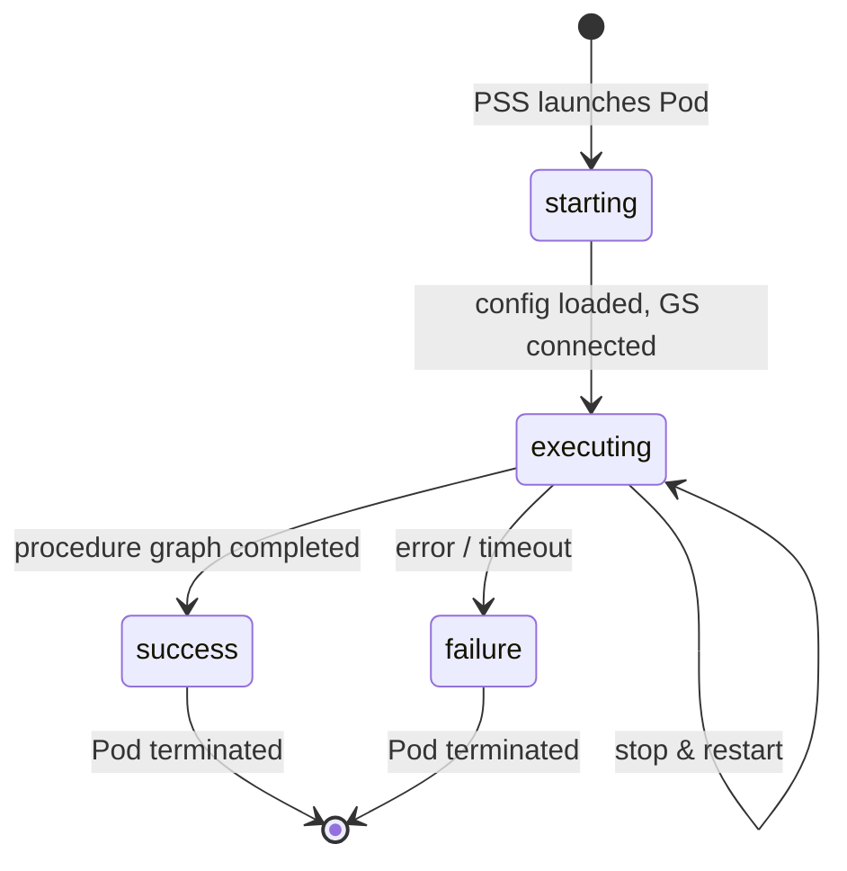
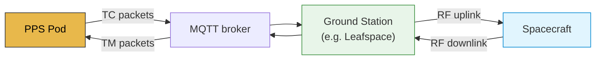
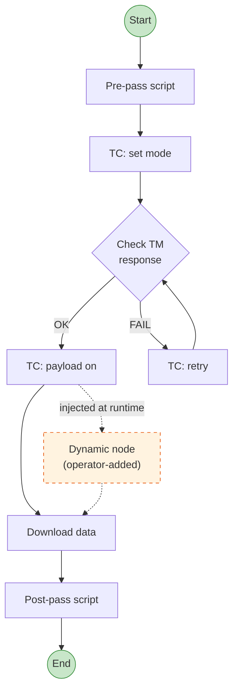
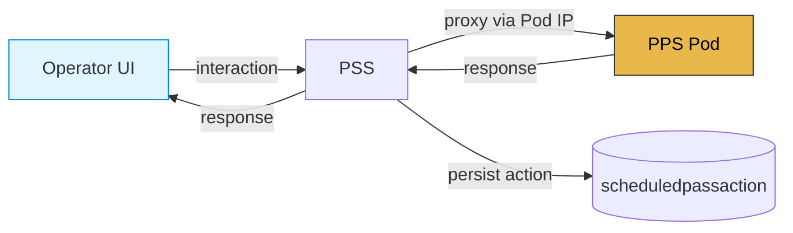
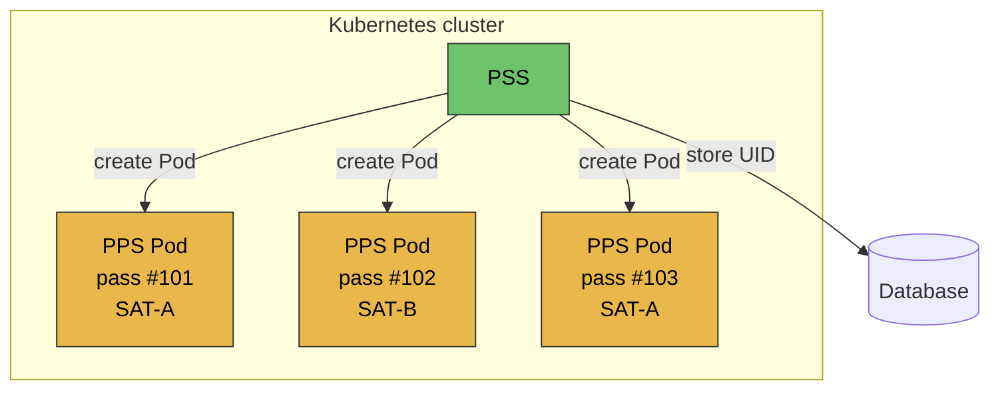

# Passes Processor Service (PPS)

> Not to be confused with [[04_Synchronization/PPS|PPS (Pulse Per Second)]] from the signal processing domain.

## What it is
The PPS is an **ephemeral batch service** that executes a single satellite pass. It is spawned as a **Kubernetes Pod** by the PSS when a scheduled pass begins, and terminated once the pass and post-processing are complete.

---

## Pass state machine

---

## Responsibilities

### Pass execution
- Runs the full pass lifecycle: preprocessing, procedure graph execution, postprocessing
- Manages pass state transitions: `starting` → `executing` → `success` / `failure`

### Ground station bridge
- Sends **telecommands (TC)** to the spacecraft via the ground station
- Receives **telemetry (TM)** packets from the spacecraft
- Supports multiple ground station providers (e.g. Leafspace via MQTT)

### Procedure graph execution
- Executes a directed graph of scripted actions (Python scripts)
- Supports conditional branching, sequential and parallel execution
- Dynamic nodes can be added/removed at runtime by operators

### Live interactions
While executing, accepts operator commands proxied through PSS:
- Skip/unskip nodes or branches
- Override script parameters
- Add/remove dynamic nodes
- Re-run actions or branches

### Security & timing
- Manages **encryption keys and IVs** for secure spacecraft communication
- Handles **time correlation** between ground and spacecraft clocks

### Event publishing
- Publishes all execution events, packets, and status updates to **RabbitMQ**
- Consumed downstream by [[05_MCS/Passes_Reporter_Service|PRS]]

---

## Deployment model

> **One pass = one Pod**

- Pod is created by PSS via Kubernetes API
- Pod UID is stored in the database for addressing
- PSS uses Pod address to proxy live operator interactions
- Pod is cleaned up after pass completion

---

## Key classes
- `PassExecutionService` — main orchestrator
- `ProcedureExecutionService` — procedure graph runner
- `PassResolverService` — pass state and deadline management
- `PacketReceiver` / `PacketSender` — TM/TC exchange with ground station
- `LeafspaceGroundStationTtcBridge` — Leafspace-specific MQTT bridge

---

## Links
- [[05_MCS/Pass_Lifecycle]]
- [[05_MCS/Passes_Reporter_Service]]
- [[05_MCS/MCS_Overview]]
