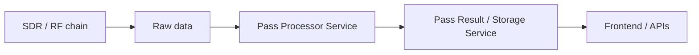

# PPS / PRS (Backend Services)

## Context
In this project, **PPS** and **PRS** are **backend services**, not RF or signal-processing concepts.

They appear in:
- DevSpace activations
- Hot reload / dev mode
- Kubernetes deployments
- Java backend code

---

## PPS — Pass Processor Service

### Role (conceptual)
The **Pass Processor Service (PPS)** is responsible for processing a **satellite pass**.

A "pass" typically means:
- a time window where a satellite is visible
- associated telemetry, SDR captures, or derived data
- metadata: start/end time, ground station, satellite ID

### Typical responsibilities
Depending on the system, PPS may:
- ingest raw data from SDR pipelines
- associate data with a specific pass
- trigger post-processing (Doppler correction, decoding, analysis)
- compute pass-level metrics
- persist results for downstream services

### Mental model
> **PPS = batch processor for one satellite pass**

---

## PRS — Pass-related Service (project-specific)

PRS is a **companion service** to PPS.
The exact meaning is project-defined, but common patterns include:

- **Pass Result Service**
- **Pass Reporting Service**
- **Pass Replay Service**
- **Pass Resource Service**

### Typical role
PRS often:
- stores processed outputs from PPS
- exposes APIs for frontend visualization
- manages pass metadata and lifecycle
- serves results for replay or analysis

### Mental model
> **PRS = storage / access layer for pass results**

---

## PPS / PRS in DevSpace

When colleagues talk about:

> "activating PPS and PRS with hot reload"

They mean:
- run these **Java services in dev mode**
- enable file sync + auto-restart
- avoid rebuilding full images on every change

This is purely **control-plane software**, not SDR data plane.

---

## Common source of confusion (important)

| Acronym | Meaning here | Meaning elsewhere |
|------|-------------|------------------|
| PPS | Pass Processor Service | Pulse Per Second (timing) |
| PRS | Pass-related Service | Pseudo-Random Sequence |
| PSS | (service name) | Primary Sync Signal (LTE) |

**Always disambiguate by context**:
- DevSpace / hot reload → software service
- I/Q, timing, SDR → RF concept

---

## How this fits the system architecture

