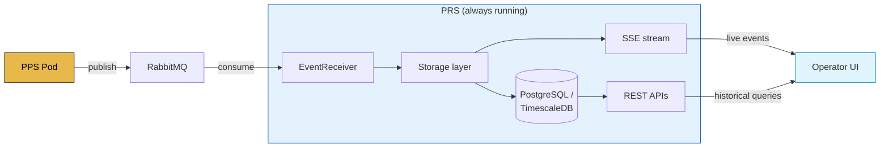
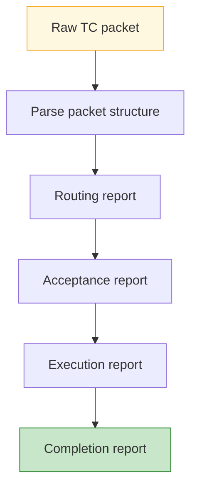

> Not to be confused with [[Synchronization/PRS and Preambles|PRS (Pseudo-Random Sequence)]] from the signal processing domain.

## What it is
The PRS is a **persistent, always-running service** that stores, analyses, and serves all execution data from satellite passes. It acts as the **data repository and query layer** for pass operations.

---

## High-level data flow

---

## Responsibilities

### Data ingestion
- Subscribes to **RabbitMQ** events published by [[MCS/Passes Processor Service|PPS]]
- Persists to database:
  - Telemetry (TM) packets
  - Telecommand (TC) packets
  - Satellite events
  - Execution events
  - Time correlation data

### Data analysis
- Parses and validates packet structures
- Extracts parameters from telemetry
- Tracks telecommand report status (routing, acceptance, completion)

### REST APIs
Exposes endpoints for querying historical data:

| Endpoint pattern | Data |
|---|---|
| `/pass-reports/{passId}/packets` | TM/TC packets for a pass |
| `/pass-reports/{passId}/logs` | Execution logs |
| `/pass-reports/{passId}/execution` | Execution events (+ SSE streaming) |
| `/satellite-log/telecommands` | Cross-pass TC search |
| `/satellite-log/telemetry` | Cross-pass TM search |
| `/parameter-monitoring/*` | Parameter values across passes |
| `/time-correlation/*` | Ground time ↔ spacecraft time mappings |
| `/satellite-events/*` | Satellite event logs |

### Real-time streaming
- **Server-Sent Events (SSE)** for streaming live execution data to the UI during an active pass

---

## Lifecycle role

The PRS is the only way to access historical pass data after the ephemeral PPS Pod terminates.

```mermaid
gantt
    title PRS role over time
    dateFormat X
    axisFormat %s

    section PPS Pod
    Pod alive (pass executing) : active, pps, 0, 5

    section RabbitMQ
    Events flowing           : active, mq, 0, 5

    section PRS
    Ingesting + SSE streaming : active, ingest, 0, 5
    Sole data source (REST)  : crit, sole, 5, 10

    section Operator
    Live monitoring via SSE  : active, live, 1, 5
    Post-pass analysis       : post, 5, 10
```

---

## Key classes
- `PacketStorageService` — TM/TC packet persistence and retrieval
- `SatelliteEventService` — satellite event storage and classification
- `TelecommandReportService` — TC status tracking
- `HouseKeepingService` — housekeeping telemetry processing
- `IngestionFlowMetricsService` — data ingestion monitoring
- `EventReceiver` — RabbitMQ event consumer
- `ExponentialBackoffExecutor` — retry logic for event processing

---

## Links
- [[MCS/Pass Lifecycle]]
- [[MCS/Passes Processor Service]]
- [[MCS/MCS Overview]]
